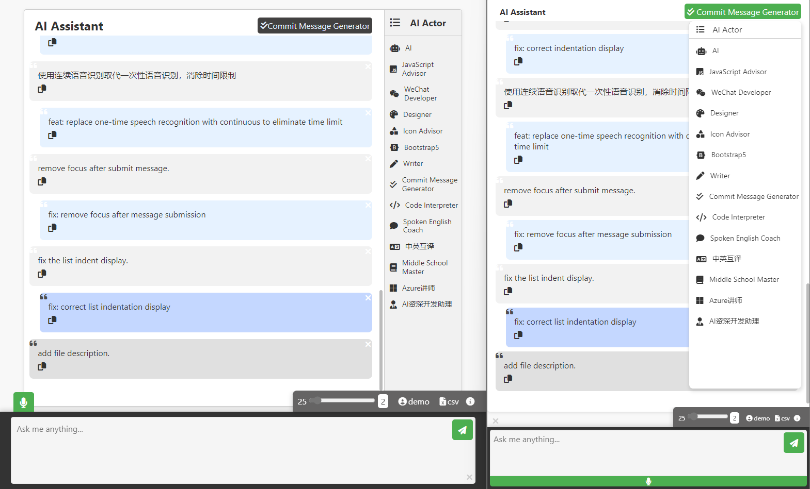

# chatGPTdemo for Azure OpenAI gpt-35-turbo (version 0301)/gpt4 model
This is a demo chatGPT website build with nodejs and Azure OpenAI gpt-35-turbo (version 0301)/gpt4 model.
You may use this code to learn how to use Azure OpenAI API to develop your chatGPT client using Javascript.

# How to run.
- Clone this project to your local machine.
- Install nodejs
- Create your .env file
    - You need to create the .env file in the root folder inside this project.
    - Get your api-key and endpoint from Azure OpenAI portal.
    - Put the your api-key and endpoint in the .env file like following format.

        ```console
        API_KEY=yourapikey

        API_URL=https://$yourendpoint/openai/deployments/$gptmodelname$/chat/completions?api-version=2023-03-15-preview

        ```
    
    - Add the optional part (not must) to get extra feature
        - PROMPT_REPO_URLS is a json object that contains the user name and the url of the prompt file.
        ```console
        PROMPT_REPO_URLS={"user1":"user1prompts.json", "user2":"user2prompts.json","user3":"user3prompts.json",}
        ```
        For the *user1prompts.json* content format, you may check the file ./public/prompts.json for example.

        - Azure AZURE_TTS is a json object that contains the subscriptionKey and the endpoint of the Azure Text-to-Speech service.

        ```console
        AZURE_TTS={"subscriptionKey":"your subscription key","endpoint":"your endpoint"}
        ```


        
## Run command in the terminal
    npm install
    node server.js

## Open your browser and go to http://localhost:3000

Here you go. Now you will see the chatGPT demo website like following image.


